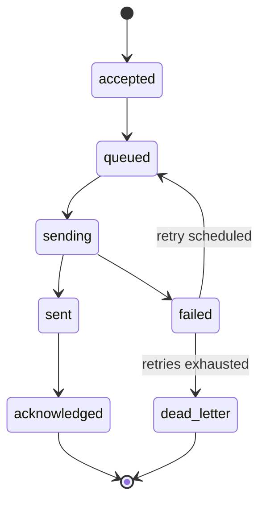

# matfix User Guide

matfix is a persistent relay daemon that exposes a simple HTTP REST API over the Matrix messaging protocol. It behaves like an MTA for Matrix: clients submit messages through the API, and matfix handles delivery, retries, encryption, and inbound correlation on their behalf.

---

## Table of Contents

1. [Overview](#1-overview)
2. [Installation](#2-installation)
3. [Configuration](#3-configuration)
4. [Running the Daemon](#4-running-the-daemon)
5. [Authentication and Authorization](#5-authentication-and-authorization)
6. [API Routes](#6-api-routes)
   - [POST /v1/send](#post-v1send)
   - [POST /v1/receive](#post-v1receive)
   - [POST /v1/ask](#post-v1ask)
   - [GET /v1/admin/queue](#get-v1adminqueue)
   - [GET /v1/admin/accounts](#get-v1adminaccounts)
   - [GET /v1/admin/subscriptions](#get-v1adminsubscriptions)
   - [GET /health/live](#get-healthlive)
   - [GET /health/ready](#get-healthready)
   - [GET /metrics](#get-metrics)
7. [Admin Socket Routes](#7-admin-socket-routes)
   - [POST /keys](#post-keys)
   - [GET /keys](#get-keys)
   - [DELETE /keys/{id}](#delete-keysid)
   - [POST /keys/{id}/rotate](#post-keysidrotate)
   - [GET /accounts](#get-accounts)
   - [GET /queue](#get-queue)
   - [GET /subscriptions](#get-subscriptions)
8. [matfixctl CLI](#8-matfixctl-cli)
9. [Message Types](#9-message-types)
10. [Inbound Event Filters](#10-inbound-event-filters)
11. [File Attachments](#11-file-attachments)
12. [End-to-End Encryption](#12-end-to-end-encryption)
13. [Outbound Delivery Lifecycle](#13-outbound-delivery-lifecycle)
14. [Troubleshooting](#14-troubleshooting)

---

## 1. Overview

matfix runs as a long-lived daemon. On startup it:

- Reads the YAML configuration file.
- Opens the SQLite database and runs any pending migrations.
- Authenticates each configured Matrix account against its homeserver.
- Starts one sync loop per account to receive inbound events.
- Starts the outbound worker pool.
- Listens on two sockets:
  - **HTTP API** (default `:8080`) - message send, receive, and ask endpoints for application clients.
  - **Admin UNIX socket** (default `/run/matfix/admin.sock`) - key management and runtime inspection, accessible only to OS-privileged callers.

TLS termination is **not** handled by matfix. Place a reverse proxy (nginx, Caddy, etc.) in front of the HTTP API socket.

---

## 2. Installation

### Prerequisites

| Requirement | Minimum version |
|---|---|
| Go | 1.21 |
| Git | any |

matfix uses `modernc.org/sqlite` (pure-Go SQLite) so **no CGO or system libraries** are needed. The Olm encryption library is provided by the `goolm` build tag (also pure Go).

### Build from source

```sh
git clone https://github.com/ilamparithi-in/matfix.git
cd matfix
make build
```

Two binaries are placed in `bin/`:

| Binary | Purpose |
|---|---|
| `bin/matfix` | The relay daemon |
| `bin/matfixctl` | Admin CLI that speaks to the daemon's UNIX socket |

### Makefile targets

| Target | Action |
|---|---|
| `make build` | Build both `matfix` and `matfixctl` |
| `make test` | Run all unit tests |
| `make lint` | Run `go vet` |
| `make run` | Build and run the daemon with default flags |
| `make clean` | Remove the `bin/` directory |

---

## 3. Configuration

matfix is configured by a YAML file. On startup, after the file is parsed, any `MATFIX_*` environment variables are overlaid on top. Missing required fields cause an immediate fatal error listing all problems at once.

### Minimal working example

```yaml
server:
  bind_addr: ":8080"

accounts:
  - id: bot
    homeserver_url: "https://matrix.example.org"
    user_id: "@bot:example.org"
    access_token: "syt_..."
    device_id: "ABCDEFGHIJ"

database:
  path: /var/lib/matfix/matfix.db

admin:
  socket_path: /run/matfix/admin.sock

queue:
  concurrency: 4

crypto:
  trust_policy: tofu

logging:
  level: info
  format: json
```

### Obtaining credentials

matfix does not perform login - it expects a pre-authenticated session. Obtain `access_token`, `device_id`, and `user_id` from your homeserver once and paste them into the config.

```sh
curl -s -X POST "https://matrix.example.org/_matrix/client/v3/login" \
  -H "Content-Type: application/json" \
  -d '{
    "type": "m.login.password",
    "identifier": { "type": "m.id.user", "user": "bot" },
    "password": "your-password",
    "device_id": "MATFIX01",
    "initial_device_display_name": "matfix"
  }' | jq '{access_token, device_id, user_id}'
```

The three fields in the `jq` output map directly to `access_token`, `device_id`, and `user_id` in the config. Omit `device_id` in the request body if you want the homeserver to generate one for you - note the value it returns.

> **Note:** if the bot account does not exist yet, register it first via your homeserver's admin API (e.g. Synapse's `register_new_matrix_user`) or the Element client.

### Full configuration reference

```yaml
# HTTP API server
server:
  # TCP address to listen on. Plain HTTP only - put TLS in a reverse proxy.
  # Default: ":8080"
  bind_addr: ":8080"

# Matrix accounts. At least one is required.
accounts:
  - # Unique identifier used in API requests as account_id.
    # Required. No default.
    id: bot

    # Base URL of the Matrix homeserver.
    # Required. No default.
    homeserver_url: "https://matrix.example.org"

    # Matrix user ID (@user:server).
    # Required. No default.
    user_id: "@bot:example.org"

    # Long-lived access token (obtained via m.login or registration).
    # Required. No default.
    access_token: "syt_..."

    # Device ID associated with the access token.
    # Required. No default.
    device_id: "ABCDEFGHIJ"

    # SSSS recovery key for restoring Megolm sessions from key backup at startup.
    # Optional. When omitted, key backup restore is skipped for this account.
    recovery_key: ""

# SQLite database
database:
  # Database driver. Currently only "sqlite" is supported.
  # Default: "sqlite"
  driver: sqlite

  # Path to the SQLite database file. Created if it does not exist.
  # Default: "matfix.db"
  path: /var/lib/matfix/matfix.db

# Admin UNIX domain socket
admin:
  # Filesystem path of the UNIX socket.
  # Default: "/run/matfix/admin.sock"
  socket_path: /run/matfix/admin.sock

# Outbound retry policy
retry_policy:
  # Maximum number of delivery attempts before a job is dead-lettered.
  # Default: 5
  max_retries: 5

  # Retry interval growth strategy: "exponential" or "linear".
  # Default: "exponential"
  backoff_policy: exponential

  # Delay before the first retry.
  # Accepts Go duration strings: "500ms", "1s", "2m".
  # Default: "1s"
  initial_interval: "1s"

  # Upper bound on the retry delay.
  # Default: "5m"
  max_interval: "5m"

  # Retry count at which a job is permanently moved to the dead-letter state.
  # Ignored when max_retries is lower. Default: 5
  dead_letter_threshold: 5

# Outbound worker pool
queue:
  # Number of concurrent worker goroutines pulling from the queue.
  # Must be > 0. Default: 4
  concurrency: 4

  # Maximum number of jobs in the queue per account before new submissions
  # are rejected. Default: 1000
  depth_limit: 1000

# End-to-end encryption
crypto:
  # Device verification strategy.
  # "tofu"      - trust the first device seen for each Matrix user (recommended for bots).
  # "allowlist" - only trust devices that appear in a pre-configured list.
  # Default: "tofu"
  trust_policy: tofu

  # What to do when an inbound event cannot be decrypted.
  # "log" - log the failure and surface the undecryptable event metadata.
  # Default: "log"
  undecryptable_handling: log

# Structured logging
logging:
  # Log level: "debug", "info", "warn", "error".
  # Default: "info"
  level: info

  # Log format: "json" or "text".
  # Default: "json"
  format: json

  # Redact potentially sensitive values (access tokens, user IDs) from logs.
  # Default: true
  redact: true

# Observability
observability:
  # Address for the Prometheus metrics scrape endpoint (/metrics).
  # Default: ":9090"
  metrics_bind: ":9090"

  # Base path for health endpoints. Currently informational only.
  # Default: "/health"
  health_path: /health
```

### Environment variable overrides

Each variable is checked only when set; unset variables leave the file value (or default) intact.

| Environment variable | Config field |
|---|---|
| `MATFIX_SERVER_BIND_ADDR` | `server.bind_addr` |
| `MATFIX_DATABASE_DRIVER` | `database.driver` |
| `MATFIX_DATABASE_PATH` | `database.path` |

---

## 4. Running the Daemon

```sh
matfix --config /etc/matfix/matfix.yaml
```

### Flags

| Flag | Default | Description |
|---|---|---|
| `--config` | `matfix.yaml` | Path to the YAML configuration file |
| `--log-level` | _(from config)_ | Override `logging.level` at launch |

### Startup order

1. Load and validate configuration (fatal if invalid).
2. Set up structured logging.
3. Open the SQLite database and run forward-only migrations.
4. Recover in-flight queue jobs (any job stuck in `sending` is reset to `queued`).
5. Start the event bus.
6. Authenticate each configured account; start its sync loop and crypto subsystem.
   - If **all** accounts fail, the daemon exits with a non-zero code.
   - If **at least one** account is available, the daemon continues.
7. Start the outbound worker pool.
8. Start the correlation manager (subscribes to the event bus).
9. Bind the admin UNIX socket.
10. Bind the HTTP API server.
11. Block on `SIGINT` / `SIGTERM`.

### Graceful shutdown

On receiving a signal, matfix stops accepting new API requests, drains in-flight workers, stops sync loops, then closes the database.

### systemd unit example

```ini
[Unit]
Description=matfix Matrix relay daemon
After=network-online.target
Wants=network-online.target

[Service]
ExecStart=/usr/local/bin/matfix --config /etc/matfix/matfix.yaml
User=matfix
RuntimeDirectory=matfix
StateDirectory=matfix
Restart=on-failure
RestartSec=5s

[Install]
WantedBy=multi-user.target
```

The `RuntimeDirectory=matfix` directive creates `/run/matfix/` automatically, which is the default parent directory for the admin socket.

---

## 5. Authentication and Authorization

All API routes (except `/health/*` and `/metrics`) require an API key passed in the `Authorization` header:

```
Authorization: Bearer <api-key>
```

API keys are managed exclusively through the admin UNIX socket (see [Section 7](#7-admin-socket-routes)). They are never provisioned or returned through the HTTP API.

### Permissions

A key may carry up to five independent restriction dimensions. An empty (null) value for any dimension means **unrestricted**.

| Dimension | JSON field | Effect |
|---|---|---|
| Accounts | `accounts` | Limits which `account_id` values the key may act on |
| Routes | `routes` | Limits which API routes are accessible: `send`, `receive`, `ask`, `admin` |
| Rooms | `rooms` | Limits which room IDs may be used as destinations or filters |
| Event types | `event_types` | Limits which inbound event types the key may subscribe to |
| Rate limit | `rate_limit_rps` | Per-key token-bucket rate in requests/second (default: 100 RPS; burst: 2× RPS) |

### Error codes

| HTTP status | `code` field | Meaning |
|---|---|---|
| `401 Unauthorized` | `unauthorized` | Missing or invalid API key |
| `403 Forbidden` | `forbidden` | Key exists but does not allow this route, account, or room |
| `429 Too Many Requests` | `rate_limited` | Per-key rate limit exceeded |

---

## 6. API Routes

Base URL: `http://<bind_addr>` (plain HTTP; add TLS via reverse proxy).

All request and response bodies are JSON. Successful mutations return `202 Accepted`; reads return `200 OK`. Errors always return a body of the form:

```json
{ "error": "human-readable message", "code": "machine_readable_code" }
```

---

### POST /v1/send

Submit an outbound message. The message is persisted to the durable queue and returned immediately with a job ID; delivery happens asynchronously.

**Authentication:** required. Key must have the `send` route permission.

#### Request body

```json
{
  "account_id": "bot",
  "destination": "!room:example.org",
  "idempotency_key": "optional-client-chosen-key",
  "message": { ... }
}
```

| Field | Type | Required | Description |
|---|---|---|---|
| `account_id` | string | yes | ID of the configured account to send from |
| `destination` | string | yes | Room ID (`!id:server`), room alias (`#alias:server`), or user ID (`@user:server`) for a DM |
| `idempotency_key` | string | no | Client-chosen key; submitting the same key twice returns the original job ID without re-sending |
| `message` | object | yes | Message payload (see [Message Types](#9-message-types)) |

#### Response - 202 Accepted

```json
{ "job_id": "01924e3f-..." }
```

#### Example

```sh
curl -X POST http://localhost:8080/v1/send \
  -H "Authorization: Bearer <key>" \
  -H "Content-Type: application/json" \
  -d '{
    "account_id": "bot",
    "destination": "!abc123:example.org",
    "message": { "type": "text", "body": "Hello, world!" }
  }'
```

---

### POST /v1/receive

Long-poll for inbound Matrix events. The request blocks until the first matching event arrives, the limit is reached, or the timeout expires. Returns `200 OK` in all cases; `timed_out: true` means the window closed with no events.

**Authentication:** required. Key must have the `receive` route permission.

#### Request body

```json
{
  "account_id": "bot",
  "filter": {
    "room_id": "!room:example.org",
    "sender_id": "@user:example.org",
    "event_type": "inbound.message",
    "in_reply_to": "$eventID",
    "body_regex": "hello.*"
  },
  "timeout_seconds": 30,
  "limit": 10
}
```

| Field | Type | Required | Description |
|---|---|---|---|
| `account_id` | string | yes | Account whose sync stream to subscribe to |
| `filter` | object | no | Event matching criteria (see [Inbound Event Filters](#10-inbound-event-filters)) |
| `timeout_seconds` | integer | yes | How long to wait (must be > 0) |
| `limit` | integer | no | Maximum number of events to collect before returning; 0 = unlimited |

#### Response - 200 OK

```json
{
  "events": [
    {
      "event_id": "$abc:example.org",
      "account_id": "bot",
      "room_id": "!room:example.org",
      "sender_id": "@user:example.org",
      "type": "inbound.message",
      "body": "Hello back!",
      "timestamp": 1716600000000,
      "attachment": null
    }
  ],
  "timed_out": false
}
```

When `timed_out` is `true` the `events` array is empty.

---

### POST /v1/ask

Send a message and wait for a correlated reply in a single request. Internally this submits the message via the queue and registers a correlation subscription. When a matching inbound event arrives it is returned inline.

Default correlation strategy: the inbound event must have an `m.in_reply_to` relation pointing at the sent event.

**Authentication:** required. Key must have the `ask` route permission.

#### Request body

```json
{
  "account_id": "bot",
  "destination": "!room:example.org",
  "idempotency_key": "optional",
  "message": { "type": "text", "body": "What is 2 + 2?" },
  "filter": {
    "sender_id": "@bot2:example.org"
  },
  "timeout_seconds": 60
}
```

| Field | Type | Required | Description |
|---|---|---|---|
| `account_id` | string | yes | Account to send from |
| `destination` | string | yes | Room ID, alias, or user ID |
| `idempotency_key` | string | no | Submission idempotency key |
| `message` | object | yes | Outbound message payload |
| `filter` | object | no | Restricts which inbound events are considered a match |
| `timeout_seconds` | integer | yes | How long to wait for a reply |

#### Response - 200 OK

```json
{
  "job_id": "01924e3f-...",
  "matched_event": { ... },
  "timed_out": false
}
```

When `timed_out` is `true`, `matched_event` is null - the outbound message was still sent.

---

### GET /v1/admin/queue

Return queue depth by state across all accounts.

**Authentication:** required. Key must have the `admin` route permission.

#### Response - 200 OK

```json
{
  "queued": 12,
  "sending": 2,
  "failed": 1,
  "dead_letter": 0
}
```

| Field | Description |
|---|---|
| `queued` | Jobs waiting for a worker |
| `sending` | Jobs actively being delivered |
| `failed` | Jobs that failed and will be retried |
| `dead_letter` | Jobs that exhausted all retries |

---

### GET /v1/admin/accounts

Return availability status of all configured accounts.

**Authentication:** required. Key must have the `admin` route permission.

#### Response - 200 OK

```json
{
  "accounts": [
    { "id": "bot", "available": true },
    { "id": "backup", "available": false, "error": "connection refused" }
  ]
}
```

---

### GET /v1/admin/subscriptions

Return the count of active long-poll subscriptions.

**Authentication:** required. Key must have the `admin` route permission.

#### Response - 200 OK

```json
{
  "asks": 3,
  "receives": 7
}
```

---

### GET /health/live

Liveness check. Returns `200 OK` as long as the process is running. Suitable for a Kubernetes `livenessProbe`.

**Authentication:** none.

#### Response - 200 OK

```json
{ "status": "ok" }
```

---

### GET /health/ready

Readiness check. Returns `200 OK` when at least one Matrix account is available; `503 Service Unavailable` otherwise. Suitable for a Kubernetes `readinessProbe`.

**Authentication:** none.

#### Response - 200 OK

```json
{
  "status": "ready",
  "accounts": {
    "bot": "available",
    "backup": "failed"
  }
}
```

#### Response - 503 Service Unavailable

```json
{
  "status": "not_ready",
  "accounts": { "bot": "failed" }
}
```

---

### GET /metrics

Prometheus scrape endpoint. Returns metrics in the standard text exposition format.

**Authentication:** none.

---

## 7. Admin Socket Routes

The admin server binds to a UNIX domain socket (default `/run/matfix/admin.sock`). Access control is entirely OS-level: only users with read/write permission on the socket file can connect. There is no application-layer authentication.

All request and response bodies are JSON with the same error format as the HTTP API.

Use `curl --unix-socket` or `matfixctl` to interact with the socket.

```sh
curl --unix-socket /run/matfix/admin.sock http://localhost/keys
```

---

### POST /keys

Create a new API key. The plaintext key is returned **exactly once** and never stored; if you lose it you must rotate.

#### Request body

```json
{
  "name": "my-service",
  "permissions": {
    "accounts": ["bot"],
    "routes": ["send", "receive"],
    "rooms": ["!abc:example.org"],
    "event_types": ["inbound.message"],
    "rate_limit_rps": 50
  }
}
```

| Field | Type | Required | Description |
|---|---|---|---|
| `name` | string | yes | Human-readable label |
| `permissions` | object | no | Restriction dimensions; omit for an unrestricted key |

The `permissions` object may include any combination of:

| Field | Type | Description |
|---|---|---|
| `accounts` | string[] | Account IDs this key may use |
| `routes` | string[] | Routes this key may access (`send`, `receive`, `ask`, `admin`) |
| `rooms` | string[] | Room IDs this key may target |
| `event_types` | string[] | Inbound event types this key may subscribe to |
| `rate_limit_rps` | integer | Per-key rate limit in requests/second (0 = server default: 100) |

#### Response - 201 Created

```json
{
  "id": "f47ac10b-...",
  "key": "a1b2c3d4e5f6...",
  "name": "my-service",
  "created_at": 1716600000000
}
```

**Save the `key` value now. It will not be shown again.**

---

### GET /keys

List all keys. The key value is never included.

#### Response - 200 OK

```json
{
  "keys": [
    {
      "id": "f47ac10b-...",
      "name": "my-service",
      "permissions": { "routes": ["send"] },
      "created_at": 1716600000000,
      "revoked_at": null
    }
  ]
}
```

Revoked keys remain in the list with a non-null `revoked_at`; they are rejected at authentication time.

---

### DELETE /keys/{id}

Permanently revoke a key. Subsequent API requests using this key receive `401 Unauthorized`.

#### Response - 204 No Content

---

### POST /keys/{id}/rotate

Atomically revoke the existing key and issue a replacement. The old key stops working immediately; the new plaintext is returned once.

#### Response - 201 Created

Same shape as [POST /keys](#post-keys) response.

---

### GET /accounts

Return account availability status. Same response shape as [GET /v1/admin/accounts](#get-v1adminaccounts).

---

### GET /queue

Return queue depth. Same response shape as [GET /v1/admin/queue](#get-v1adminqueue).

---

### GET /subscriptions

Return active subscription counts. Same response shape as [GET /v1/admin/subscriptions](#get-v1adminsubscriptions).

---

## 8. matfixctl CLI

`matfixctl` communicates with the daemon over the admin UNIX socket. It is the recommended way to manage API keys and inspect runtime state.

```sh
matfixctl [--socket <path>] <command>
```

| Global flag | Default | Description |
|---|---|---|
| `--socket` | `/run/matfix/admin.sock` | Path to the admin socket |

### Keys

#### Create

```sh
matfixctl keys create --name <name> [options]
```

| Flag | Default | Description |
|---|---|---|
| `--name` | _(required)_ | Human-readable key label |
| `--accounts` | any | Comma-separated account IDs |
| `--routes` | any | Comma-separated routes: `send,receive,ask,admin` |
| `--rooms` | any | Comma-separated room IDs |
| `--event-types` | any | Comma-separated event types |
| `--rate-limit` | 0 (server default) | Requests/second limit |

Example:

```sh
matfixctl keys create \
  --name "webhook-service" \
  --routes send,receive \
  --accounts bot \
  --rate-limit 20
```

Output:

```
Key ID:     f47ac10b-58cc-4372-a567-0e02b2c3d479
Name:       webhook-service
Key:        a1b2c3d4e5f6...
            (save this - it will not be shown again)
Created At: 2026-05-25T10:00:00Z
```

#### List

```sh
matfixctl keys list
```

Outputs a table showing key IDs, names, creation times, revocation times, and route scopes. The key value is never shown.

#### Revoke

```sh
matfixctl keys revoke <id>
```

#### Rotate

```sh
matfixctl keys rotate <id>
```

Outputs the new key in the same format as `keys create`.

### Accounts

```sh
matfixctl accounts
```

Shows the availability status of each configured Matrix account.

### Queue

```sh
matfixctl queue
```

Shows the count of outbound jobs in `queued`, `sending`, `failed`, and `dead_letter` states.

### Subscriptions

```sh
matfixctl subscriptions
```

Shows the number of active `ask` and `receive` long-poll subscriptions.

---

## 9. Message Types

The `message.type` field in send, ask, and receive requests selects the Matrix event variant.

### text

Plain-text message (`m.text`).

```json
{
  "type": "text",
  "body": "Hello, world!"
}
```

### html

HTML-formatted message (`m.text` with `format: org.matrix.custom.html`). The `body` field is the mandatory plain-text fallback.

```json
{
  "type": "html",
  "body": "Hello, world!",
  "formatted_body": "<b>Hello</b>, world!"
}
```

HTML content is sanitized before sending.

### reply

A message that quotes and replies to an existing event.

```json
{
  "type": "reply",
  "in_reply_to": "$abc123:example.org",
  "body": "I agree.",
  "formatted_body": "<b>I agree.</b>"
}
```

| Field | Required | Description |
|---|---|---|
| `in_reply_to` | yes | Event ID of the message being replied to |
| `body` | yes | Plain-text reply body |
| `formatted_body` | no | HTML-formatted reply body |

### reaction

React to an event with an emoji or text.

```json
{
  "type": "reaction",
  "target_event_id": "$abc123:example.org",
  "key": "👍"
}
```

### edit

Replace the body of a previously sent event.

```json
{
  "type": "edit",
  "target_event_id": "$abc123:example.org",
  "body": "Corrected text.",
  "formatted_body": "<i>Corrected text.</i>"
}
```

### redaction

Remove an event from the room.

```json
{
  "type": "redaction",
  "target_event_id": "$abc123:example.org",
  "reason": "Sent by mistake"
}
```

### file

Upload and send a file, image, audio clip, or video. See [File Attachments](#11-file-attachments) for full details.

```json
{
  "type": "file",
  "body": "Photo from the site visit",
  "file": {
    "data": "<base64-encoded bytes>",
    "mime_type": "image/png",
    "filename": "screenshot.png",
    "width": 1920,
    "height": 1080
  }
}
```

For media captions, set the top-level `body` field. Optional
`formatted_body` may be used for an HTML-formatted caption when `body` is also
provided. If `body` is omitted, matfix uses `file.filename` as the Matrix
fallback body.

---

## 10. Inbound Event Filters

The `filter` object in `receive` and `ask` requests is a recursive **FilterNode** expression that narrows which inbound events are delivered. All predicates set within a single node are ANDed. A node with no fields set matches every event.

### 10.1 FilterNode fields

#### Set filters (`StringSetFilter`)

Each set filter has an `include` whitelist and an `exclude` blacklist. Both may be present simultaneously; exclude takes precedence. At least one of `include` or `exclude` must be non-empty if the field is present.

| Field | Type | Description |
|---|---|---|
| `sender_id` | `StringSetFilter` | Filter by sender Matrix ID (see applicability table) |
| `room_id` | `StringSetFilter` | Filter by room ID |
| `event_type` | `StringSetFilter` | Filter by internal event type string |

```json
{ "sender_id": { "exclude": ["@spam:example.org"] } }
```

```json
{ "room_id": { "include": ["!main:example.org", "!dev:example.org"] } }
```

#### Scalar predicates

| Field | Type | Description |
|---|---|---|
| `in_reply_to` | `string` | Match events whose `m.in_reply_to` equals this event ID |
| `body_regex` | `string` | Go regular expression matched against the event body |
| `reaction_key` | `string` | Match reactions with exactly this key/emoji |
| `relates_to_event_id` | `string` | Match events related to this event ID (reaction, edit, redaction) |
| `has_attachment` | `bool` | `true` — event must carry an attachment; `false` — must not |
| `min_timestamp` | `int64` | Minimum event timestamp, Unix milliseconds (0 = unset) |
| `max_timestamp` | `int64` | Maximum event timestamp, Unix milliseconds (0 = unset) |

#### Combinators

| Field | Type | Description |
|---|---|---|
| `all_of` | `[FilterNode]` | All child nodes must match (must be non-empty when set) |
| `any_of` | `[FilterNode]` | At least one child node must match (must be non-empty when set) |
| `not` | `FilterNode` | Child node must **not** match |

Combinators may be nested to arbitrary depth.

### 10.2 Event-type applicability

Predicates that are set but do not apply to the matched event type cause the filter to **never match** for that event (strict semantics — there is no silent ignore).

| Predicate | `inbound.message` | `inbound.reaction` | `inbound.edit` | `inbound.redaction` | `inbound.membership` | `inbound.receipt` |
|---|---|---|---|---|---|---|
| `sender_id` | `SenderID` | `SenderID` | `SenderID` | `SenderID` | `UserID` | `UserID` |
| `in_reply_to` | `InReplyTo` | ✗ never | ✗ never | ✗ never | ✗ never | ✗ never |
| `body_regex` | `Body` | ✗ never | `NewBody` | ✗ never | ✗ never | ✗ never |
| `has_attachment` | `Attachment != nil` | ✗ never | ✗ never | ✗ never | ✗ never | ✗ never |
| `reaction_key` | ✗ never | `Key` | ✗ never | ✗ never | ✗ never | ✗ never |
| `relates_to_event_id` | ✗ never | `RelatesToEventID` | `RelatesToEventID` | `Redacts` | ✗ never | ✗ never |

### 10.3 Examples

**Match any reply to a specific outbound event:**
```json
{ "in_reply_to": "$outbound-event-id:example.org" }
```

**Exclude a spam sender across all event types:**
```json
{ "sender_id": { "exclude": ["@spam:example.org"] } }
```

**Only thumbs-up reactions to a specific message:**
```json
{
  "event_type":          { "include": ["inbound.reaction"] },
  "reaction_key":        "👍",
  "relates_to_event_id": "$target-event-id"
}
```

**Messages in a time window that have an attachment:**
```json
{
  "has_attachment":  true,
  "min_timestamp":   1716600000000,
  "max_timestamp":   1716686400000
}
```

**Any message with an attachment OR marked urgent:**
```json
{
  "any_of": [
    { "has_attachment": true },
    { "body_regex": "(?i)urgent" }
  ]
}
```

**Messages from @alice or @bob, but not containing "off the record":**
```json
{
  "sender_id": { "include": ["@alice:example.org", "@bob:example.org"] },
  "not": { "body_regex": "(?i)off the record" }
}
```

**Invalid filter — body_regex is inapplicable to reactions, so this never matches:**
```json
{
  "event_type": { "include": ["inbound.reaction"] },
  "body_regex":  "hello"
}
```

### 10.4 Inbound event payload

When events are returned (by `receive` or `ask`):

```json
{
  "event_id":   "$abc:example.org",
  "account_id": "bot",
  "room_id":    "!room:example.org",
  "sender_id":  "@user:example.org",
  "type":       "inbound.message",
  "body":       "Hello back!",
  "timestamp":  1716600000000,
  "attachment": null
}
```

`timestamp` is Unix time in **milliseconds**. The `type` field corresponds to the internal event type strings used in `event_type` set filters (e.g. `"inbound.message"`, `"inbound.reaction"`, `"inbound.edit"`, `"inbound.redaction"`, `"inbound.membership"`, `"inbound.receipt"`).

---

## 11. File Attachments

### Sending a file

Set `message.type` to `"file"` and include a `file` object:

```json
{
  "type": "file",
  "body": "Quarterly report",
  "file": {
    "data":      "<standard base64, no line breaks>",
    "mime_type": "application/pdf",
    "filename":  "report.pdf"
  }
}
```

`body` is optional for file attachments and is sent as the visible Matrix media
caption. `formatted_body` is also supported for HTML-formatted captions, but it
must be paired with `body`. When no caption is provided, matfix keeps the
previous behavior and uses `filename` as the Matrix `body` fallback.

Optional metadata fields for images and video:

```json
{
  "width":    1920,
  "height":   1080,
  "duration": 3600
}
```

`duration` is in **milliseconds**.

**Hard limit:** decoded file size must not exceed **50 MiB** (52 428 800 bytes). Requests exceeding this limit receive `400 Bad Request` before the job is queued.

matfix infers the Matrix message type from the MIME type:

| MIME prefix | Matrix type |
|---|---|
| `image/*` | `m.image` |
| `audio/*` | `m.audio` |
| `video/*` | `m.video` |
| anything else | `m.file` |

In encrypted rooms the file is encrypted client-side before upload; key material is stored in the Matrix event and remains opaque to the homeserver.

### Receiving a file

When an inbound message carries an attachment, the `attachment` field is populated:

```json
{
  "event_id":  "$abc:example.org",
  "type":      "inbound.message",
  "body":      "report.pdf",
  "attachment": {
    "url":       "mxc://example.org/abc123",
    "mime_type": "application/pdf",
    "filename":  "report.pdf",
    "size":      204800,
    "encrypted_file": null
  }
}
```

For attachments from **encrypted rooms**, `url` is null and `encrypted_file` is populated:

```json
{
  "encrypted_file": {
    "url":     "mxc://example.org/enc456",
    "key":     "<base64url AES-256-CTR key>",
    "iv":      "<base64 IV>",
    "sha256":  "<base64 ciphertext hash>",
    "version": "v2"
  }
}
```

**matfix surfaces the URL and key material only.** Your application is responsible for downloading the ciphertext from the MXC URL and decrypting it locally using the `key`, `iv`, and `sha256` fields.

---

## 12. End-to-End Encryption

matfix fully supports Matrix E2EE (Olm + Megolm) via mautrix-go. No configuration beyond `crypto.trust_policy` is needed for most deployments.

### Trust policy

| Value | Behaviour |
|---|---|
| `tofu` | Automatically trust the first device seen for each Matrix user (Trust On First Use). Subsequent key changes emit a warning. Recommended for bots. |
| `allowlist` | Only trust devices that appear in a pre-configured allowlist. Use in high-security environments. |

### Key backup restore

If an account's `recovery_key` is set, matfix restores Megolm sessions from the homeserver's key backup at startup. This allows decryption of messages sent while the daemon was offline.

```yaml
accounts:
  - id: bot
    recovery_key: "EsT... (your SSSS recovery key)"
```

Key backup **upload** is not performed - matfix only restores from backup, it does not contribute to it.

### Undecryptable events

When an inbound event cannot be decrypted (for example, because the sender's session was established before the daemon started and no backup is available), matfix:

1. Logs the failure with the event ID and room ID.
2. Exposes the event metadata (event ID, sender, room, timestamp) without the body.
3. Does **not** crash or stop the sync loop.

---

## 13. Outbound Delivery Lifecycle

Every outbound message moves through the following states:



| State | Description |
|---|---|
| `accepted` | Job created by the submission manager |
| `queued` | Waiting for a worker |
| `sending` | Being delivered to the homeserver |
| `sent` | Homeserver accepted the event |
| `acknowledged` | Delivery confirmed |
| `failed` | Delivery attempt failed; scheduled for retry |
| `dead_letter` | Exhausted all retries; manual intervention required |

Jobs in `sending` at the time of a crash are automatically reset to `queued` at next startup.

Idempotency keys prevent duplicate submissions: if you submit a request with an `idempotency_key` that already exists in the database, the original `job_id` is returned immediately without creating a new job.

---

## 14. Troubleshooting

### Daemon does not start - "config validation failed"

matfix prints every configuration problem at once. Read the full error output. Common causes:

- Missing required field (`account_id`, `homeserver_url`, `user_id`, `access_token`, `server.bind_addr`, `database.path`, `admin.socket_path`).
- `queue.concurrency` set to 0 or negative.
- `crypto.trust_policy` not `"tofu"` or `"allowlist"`.
- `logging.format` not `"json"` or `"text"`.

### Daemon exits immediately at startup

All configured accounts failed to connect. Check:

- Homeserver URL is reachable from the daemon host.
- `access_token` is valid and not expired.
- `device_id` matches the token's device.
- Network/firewall rules allow outbound HTTPS to the homeserver.

Inspect the `GET /health/ready` response (or `matfixctl accounts`) after startup to see per-account error messages.

### /health/ready returns 503

At least one account connected but the readiness check still fails when **zero** accounts are available. See the `accounts` map in the response for per-account status:

```json
{ "status": "not_ready", "accounts": { "bot": "failed" } }
```

### API request returns 401 Unauthorized

- The `Authorization: Bearer` header is missing or malformed.
- The key has been revoked (`matfixctl keys list` shows a non-null `revoked_at`).
- The key value was rotated and the old value is being used.

### API request returns 403 Forbidden

The key's `routes`, `accounts`, or `rooms` restrictions do not allow this request. Check the key's permissions with `matfixctl keys list` and recreate or rotate it with broader permissions if needed.

### POST /v1/send returns 400 "destination not found"

- Room alias `#alias:server` could not be resolved on the homeserver.
- User ID `@user:server` does not exist on the homeserver (DM creation failed).
- Double-check the destination value and homeserver reachability.

### POST /v1/send returns 400 "file attachment exceeds 50 MiB limit"

Reduce the file size or pre-compress before submitting. The hard cap is enforced before the job is enqueued.

### Messages are queued but never delivered

Check:

1. `matfixctl queue` - are jobs stuck in `sending` (possible crash recovery issue)? Restart the daemon; it will reset them to `queued`.
2. `matfixctl queue` - are jobs in `dead_letter`? All retries are exhausted. Inspect the database directly for error details.
3. `matfixctl accounts` - is the target account available? Workers cannot deliver for unavailable accounts.
4. Homeserver federation issues - the remote server may be temporarily unreachable. Jobs will retry automatically with exponential backoff.

### Dead-letter jobs

Jobs in `dead_letter` have exhausted all configured retries. To investigate:

1. Query the `outbound_queue` table in the SQLite database for the job's last error.
2. Fix the underlying cause (homeserver unavailable, room access denied, etc.).
3. There is no automatic dead-letter replay in v1; you may re-submit the message via the API with a new idempotency key.

### Inbound events are not received

- Ensure the account's sync loop is running: `matfixctl accounts` should show `available: true`.
- Confirm the bot account is a member of the target room.
- For encrypted rooms, verify `crypto.trust_policy` is correct and that device sessions have been established.
- Check that `timeout_seconds` in the `receive` request is long enough.

### Encrypted messages cannot be decrypted

Possible causes:

- The daemon was offline when the Megolm session was created by the sender. Configure `recovery_key` to restore sessions from key backup.
- The sender's device has rotated its Megolm session since last contact.
- The bot account was not in the room when the session was shared.

The `undecryptable_handling: log` setting means events whose body cannot be decrypted will still appear in `receive` responses - check for a non-empty `event_id` but empty `body`.

### Admin socket connection refused

- Check that the daemon is running.
- Verify the socket path with `matfixctl --socket /path/to/admin.sock accounts`.
- Check filesystem permissions on the socket file:
  ```sh
  ls -la /run/matfix/admin.sock
  ```
  The calling user must have read and write permission.

### Metrics endpoint is not available

The metrics server binds to `observability.metrics_bind` (default `:9090`), which is a **separate port** from the HTTP API. Ensure nothing else is bound to that port and that your Prometheus instance can reach it.
